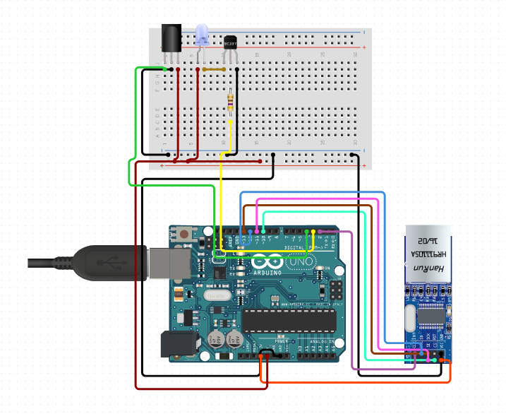

# DaikinAPI
A client to control the FXZQ-A Daikin air conditioning unit. It uses Arduino to send IR signal to the air condioning unit. The Arduino emulates the BRC4C160 remote control. It can be controlled over HTTP using the C# project that is included.

## Arduino
Simplified connection diagram looks like this: https://www.circuito.io/app?components=512,9349,10266,11021,299273.
## 

## Daikin Client
To control the air conditioning unit use the DaikinClient. 

Create the DaikinClient:
```
var daikinClient = new DaikinClient("192.168.1.55");
```

Get the current status:
```
var status = await daikinClient.GetStateAsync();
```

## Credits
This project was based upon https://github.com/danny-source/Arduino_DY_IRDaikin. It has been modified and simplified to emulate BRC4C160 in order to support my AC unit.